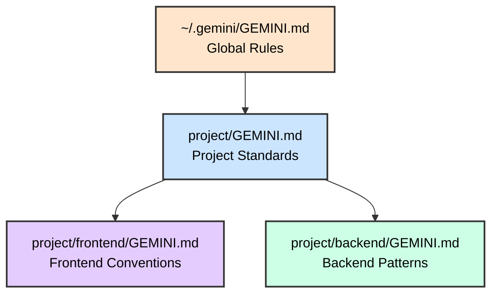

<style>
.slidev-page-num {
  display: block !important;
  opacity: 1 !important;
  visibility: visible !important;
  position: fixed !important;
  bottom: 1rem !important;
  right: 1rem !important;
  z-index: 100 !important;
  color: #666 !important;
  font-size: 0.875rem !important;
}
</style>

# Agentic Coding with Gemini CLI

## Google's AI Agent in Your Terminal

<div class="pt-12">
  <span @click="$slidev.nav.next" class="px-2 py-1 rounded cursor-pointer" hover="bg-white bg-opacity-10">
    Press Space for next page <carbon:arrow-right class="inline"/>
  </span>
</div>

---

# Contact Info

Ken Kousen
Kousen IT, Inc.

- ken.kousen@kousenit.com
- http://www.kousenit.com
- http://kousenit.org (blog)
- Social Media:
  - [@kenkousen](https://twitter.com/kenkousen) (twitter)
  - [@kenkousen@foojay.social](https://foojay.social/@kenkousen) (mastodon)
  - [@kousenit.com](https://bsky.app/profile/kousenit.com) (bluesky)
- *Tales from the jar side* (free newsletter)
  - https://kenkousen.substack.com
  - https://youtube.com/@talesfromthejarside

---

# Course Overview

<v-clicks>

- **Duration**: 5 hours of hands-on learning
- **Format**: Instructor-led with multiple labs
- **Hands-on Labs**: Real codebases in Python, JavaScript, Java
- **Prerequisites**: Command-line experience, development background

</v-clicks>

---

# Topics Covered

<v-clicks>

- **Foundation**: Installation, CLI basics, authentication
- **Core Skills**: File operations, shell integration, context management
- **Customization**: GEMINI.md, custom commands, settings.json
- **Safety**: Sandbox mode, approval policies, checkpointing
- **Advanced**: MCP integration, extensions, session management

</v-clicks>

---

# What is Gemini CLI?

<v-clicks>

- Open-source AI agent from Google
- **Gemini 3 Pro** (latest) or Gemini 2.5 Pro/Flash
- Built-in tools: Google Search, file ops, shell, web fetch
- Model Context Protocol (MCP) support
- Designed for developers who live in the terminal

</v-clicks>

---

# Key Differentiators

<v-clicks>

- **Massive Context**: 1 million token context window
- **Google Search Grounding**: Real-time web access
- **Free Tier Available**: Generous API limits
- **Open Source**: Fully open, community-driven
- **MCP Native**: Built-in Model Context Protocol support

</v-clicks>

---

# Models Available

<v-clicks>

- **Gemini 3 Pro**: Most intelligent, best for complex coding
- **Gemini 2.5 Pro**: Strong performance, 1M token context
- **Gemini 2.5 Flash**: Faster, lower cost option
- **Auto routing**: CLI picks best model for each task

</v-clicks>

---

# API Access

<v-clicks>

- **Free Tier**: Generous daily limits
- **Google AI Ultra**: Full Gemini 3 Pro access
- **Paid API Key**: Pay-as-you-go pricing
- Enable via `/settings` → "Preview features"

</v-clicks>

📖 **Get API Key**: [Google AI Studio](https://aistudio.google.com/apikey)

---

# Installation

<v-clicks>

- **npm** (recommended): `npm install -g @google/gemini-cli`
- **npx** (no install): `npx @google/gemini-cli`
- Verify: `gemini --version`
- Current version: 0.19.x

</v-clicks>

```bash
# Install globally
npm install -g @google/gemini-cli

# Verify installation
gemini --version
```

---

# Authentication

<v-clicks>

- **Environment Variable**: `export GEMINI_API_KEY="your-key"`
- **Global .env file**: `~/.gemini/.env`
- **Project .env file**: `./.gemini/.env`
- **Google Cloud**: `GOOGLE_CLOUD_PROJECT` for Vertex AI

</v-clicks>

```bash
# Option 1: Environment variable
export GEMINI_API_KEY="your-api-key"

# Option 2: Global .env file
echo 'GEMINI_API_KEY=your-api-key' >> ~/.gemini/.env

# Option 3: Project .env file
mkdir -p .gemini && echo 'GEMINI_API_KEY=your-api-key' >> .gemini/.env
```

---

# Basic Usage Modes

<v-clicks>

- **Interactive REPL**: `gemini` - Start a conversation
- **One-shot**: `gemini "prompt"` - Single response
- **Piped input**: `echo "task" | gemini`
- **Interactive with context**: `gemini -i "initial context"`

</v-clicks>

```bash
# Interactive mode
gemini

# One-shot mode
gemini "Explain what this codebase does"

# With initial context
gemini -i "You are a Python expert"
```

---
layout: image-right
image: https://images.unsplash.com/photo-1555949963-ff9fe0c870eb?ixlib=rb-4.0.3&auto=format&fit=crop&w=1920&q=80
backgroundSize: cover
---

# Core Features

<div class="text-center mt-20">
  <h2 class="text-4xl font-bold text-white bg-black bg-opacity-60 px-6 py-3 rounded-lg">
    Essential Capabilities
  </h2>
  <p class="text-xl text-white bg-black bg-opacity-60 px-4 py-2 rounded mt-4">
    Master the fundamentals
  </p>
</div>

---

# File References with @

<v-clicks>

- Reference files directly: `@./src/main.js`
- Reference directories: `@./src/` (recursive)
- Reference images: `@./screenshot.png`
- Multiple references in one prompt

</v-clicks>

```bash
# Reference a specific file
gemini "Explain @./src/app.py"

# Reference multiple files
gemini "Compare @./old.js and @./new.js"

# Reference a directory
gemini "Analyze the architecture in @./src/"
```

---

# Shell Integration with !

<v-clicks>

- Execute shell commands: `!git status`
- Toggle persistent shell mode: `!`
- Gemini can observe and analyze output
- Combine with AI analysis

</v-clicks>

```bash
# In interactive mode:
> !npm test
# Gemini sees the test output

> !git diff
# Ask Gemini to analyze the changes

# Toggle persistent shell mode
> !
```

---

# Slash Commands: Navigation

<v-clicks>

- `/help` - Show available commands
- `/clear` - Clear conversation history
- `/memory show` - View loaded context
- `/memory refresh` - Reload GEMINI.md files

</v-clicks>

---

# Slash Commands: Sessions

<v-clicks>

- `/init` - Generate project GEMINI.md
- `/chat save <tag>` - Save conversation
- `/compress` - Summarize conversation
- `/restore` - Recover from checkpoint

</v-clicks>

---

# Slash Commands in Action

```bash
# Show what context is loaded
/memory show

# Reload all GEMINI.md files
/memory refresh

# Generate a GEMINI.md for current project
/init

# Save current conversation
/chat save feature-implementation

# Compress long conversation
/compress
```

---

# Keyboard Shortcuts: Editing

<v-clicks>

- `Ctrl+L` - Clear screen
- `Ctrl+V` - Paste text/images
- `Ctrl+X` - Open external editor

</v-clicks>

---

# Keyboard Shortcuts: Control

<v-clicks>

- `Ctrl+Y` - Toggle auto-approval (YOLO mode)
- `Ctrl+C` - Cancel current operation
- `Ctrl+D` - Exit Gemini CLI

</v-clicks>

---

# Built-in Tools

<v-clicks>

- **File System**: `read_file()`, `write_file()`, `replace()`, `glob()`
- **Shell**: Execute terminal commands
- **Web**: `google_web_search()`, `web_fetch()`
- **Memory**: `save_memory()` for cross-session recall

</v-clicks>

```bash
# Gemini automatically uses appropriate tools
"Search the web for React 19 new features"
# Uses google_web_search()

"Read all Python files in src/"
# Uses glob() and read_file()

"Update the README with the changes we made"
# Uses write_file()
```

---
layout: image-right
image: https://images.unsplash.com/photo-1488590528505-98d2b5aba04b?ixlib=rb-4.0.3&auto=format&fit=crop&w=1920&q=80
backgroundSize: cover
---

# Safety & Control

<div class="mt-20">
  <h2 class="text-4xl font-bold text-white bg-black bg-opacity-60 px-6 py-3 rounded-lg">
    Work Safely
  </h2>
  <p class="text-xl text-white bg-black bg-opacity-60 px-4 py-2 rounded mt-4">
    Approval modes and sandboxing
  </p>
</div>

---

# Approval Modes

<v-clicks>

- **default**: Prompt for approval on tool calls
- **auto_edit**: Auto-approve file edit tools only
- **yolo**: Auto-approve ALL tool calls

</v-clicks>

```bash
# Default - asks for approval
gemini

# Auto-approve edits only
gemini --approval-mode auto_edit

# Auto-approve everything (YOLO mode)
gemini --yolo
# Or use Ctrl+Y in interactive mode
```

---

# Sandbox Mode

<v-clicks>

- Isolate file operations in a container
- Requires Docker or Podman
- Prevents accidental system changes
- Perfect for exploring unfamiliar code

</v-clicks>

```bash
# Run in sandbox mode
gemini --sandbox

# Or with -s flag
gemini -s "Refactor this entire codebase"
```

---

# Checkpointing

<v-clicks>

- **Automatic**: Snapshots created before each file modification
- **Shadow Git**: Stored in `~/.gemini/history/` (not your repo)
- **Includes**: Files + conversation + tool call
- **Disabled by default**: Must enable in settings

</v-clicks>

```json
// ~/.gemini/settings.json
{ "checkpointing": { "enabled": true } }
```

---

# Restoring Checkpoints

```bash
# List and select a checkpoint to restore
/restore

# Shows timestamps + filename + tool name
# e.g., 2025-06-22T10-00-00_000Z-app.py-write_file
```

Restores files AND resets conversation to that point

---
layout: image-left
image: https://images.unsplash.com/photo-1454165804606-c3d57bc86b40?ixlib=rb-4.0.3&auto=format&fit=crop&w=1920&q=80
backgroundSize: cover
---

# Context Management

<div class="text-center mt-20">
  <h2 class="text-4xl font-bold text-white bg-black bg-opacity-60 px-6 py-3 rounded-lg">
    GEMINI.md Files
  </h2>
  <p class="text-xl text-white bg-black bg-opacity-60 px-4 py-2 rounded mt-4">
    Project memory and instructions
  </p>
</div>

---

# What is GEMINI.md?

<v-clicks>

- **Project memory** loaded automatically
- **Coding standards** and conventions
- **Architecture context** for the AI
- **Persistent instructions** across sessions
- Similar to CLAUDE.md or AGENTS.md

</v-clicks>

---

# Hierarchical Loading



More specific files override general ones

---

# Example GEMINI.md

```markdown
# Project: Weather API

## Tech Stack
- Backend: Python Flask
- Database: PostgreSQL
- Testing: pytest

## Coding Standards
- Use type hints for all functions
- Follow PEP 8 style guide
- Write docstrings for public APIs

## Current Focus
Implementing caching layer for API responses
```

---

# Memory Commands

<v-clicks>

- `/memory show` - View combined context
- `/memory refresh` - Reload all GEMINI.md files
- `/memory add <text>` - Append to global GEMINI.md
- `/init` - Generate starter GEMINI.md

</v-clicks>

```bash
# See what context is loaded
/memory show

# Add a quick note to global memory
/memory add "Always use async/await for database calls"

# Generate a project-specific GEMINI.md
/init
```

---

# Modular Imports

<v-clicks>

- Import other files with `@file.md` syntax
- Break large context into components
- Supports relative and absolute paths

</v-clicks>

```markdown
# GEMINI.md

## Project Overview
@./docs/architecture.md

## Coding Standards
@./docs/style-guide.md

## API Documentation
@./docs/api-reference.md
```

---
layout: image-right
image: https://images.unsplash.com/photo-1558494949-ef010cbdcc31?ixlib=rb-4.0.3&auto=format&fit=crop&w=1920&q=80
backgroundSize: cover
---

# Configuration

<div class="mt-20">
  <h2 class="text-4xl font-bold text-white bg-black bg-opacity-60 px-6 py-3 rounded-lg">
    Customize Your Setup
  </h2>
  <p class="text-xl text-white bg-black bg-opacity-60 px-4 py-2 rounded mt-4">
    settings.json and environment
  </p>
</div>

---

# Configuration Layers

<v-clicks>

1. **Default values** - Built-in defaults
2. **User settings** - `~/.gemini/settings.json`
3. **Project settings** - `.gemini/settings.json`
4. **Environment variables** - Including `.env` files
5. **Command-line arguments** - Highest priority

</v-clicks>

---

# settings.json Options

```json
{
  "theme": "Default",
  "vimMode": false,
  "hideTips": false,
  "hideBanner": false,
  "autoAccept": false,
  "sandbox": false,
  "checkpointing": true,
  "preferredEditor": "vscode"
}
```

---

# Tool Configuration

<v-clicks>

- **coreTools**: Whitelist available tools
- **excludeTools**: Blacklist specific tools
- Restrict dangerous operations for safety

</v-clicks>

```json
{
  "coreTools": ["read_file", "write_file", "glob"],
  "excludeTools": ["shell"]
}
```

---

# File Filtering

<v-clicks>

- **respectGitIgnore**: Honor .gitignore patterns
- **enableRecursiveFileSearch**: Recursive completion
- **.geminiignore**: Custom ignore patterns

</v-clicks>

```json
{
  "fileFiltering": {
    "respectGitIgnore": true,
    "enableRecursiveFileSearch": true
  }
}
```

---

# Environment Variables

| Variable | Purpose |
|----------|---------|
| `GEMINI_API_KEY` | API authentication (required) |
| `GEMINI_MODEL` | Override default model |
| `GOOGLE_CLOUD_PROJECT` | GCP project for Vertex AI |
| `GOOGLE_CLOUD_LOCATION` | GCP region |
| `HTTP_PROXY` | Network proxy |

---

# Custom Context Filename

<v-clicks>

- Change from `GEMINI.md` to custom name
- Support multiple filenames
- Include additional directories

</v-clicks>

```json
{
  "context": {
    "fileName": ["CONTEXT.md", "GEMINI.md"],
    "includeDirectories": ["~/shared-context"],
    "loadFromIncludeDirectories": true
  }
}
```

---
layout: image-right
image: https://images.unsplash.com/photo-1516321318423-f06f85e504b3?ixlib=rb-4.0.3&auto=format&fit=crop&w=1920&q=80
backgroundSize: cover
---

# Advanced Features

<div class="mt-20">
  <h2 class="text-4xl font-bold text-white bg-black bg-opacity-60 px-6 py-3 rounded-lg">
    Power User Tools
  </h2>
  <p class="text-xl text-white bg-black bg-opacity-60 px-4 py-2 rounded mt-4">
    MCP, Extensions, Sessions
  </p>
</div>

---

# Model Context Protocol (MCP)

<v-clicks>

- Standard protocol for AI-to-system connections
- Connect to external tools and services
- Supports local commands, HTTP, and SSE
- OAuth 2.0 for remote authentication

</v-clicks>

---

# MCP Configuration: GitHub

```json
{
  "mcpServers": {
    "github": {
      "command": "npx",
      "args": ["@modelcontextprotocol/server-github"],
      "env": {
        "GITHUB_TOKEN": "${GITHUB_TOKEN}"
      }
    }
  }
}
```

---

# MCP Configuration: Database

```json
{
  "mcpServers": {
    "postgres": {
      "command": "npx",
      "args": ["@modelcontextprotocol/server-postgres"],
      "env": {
        "CONNECTION_STRING": "${DATABASE_URL}"
      }
    }
  }
}
```

---

# Managing MCP Servers

```bash
# List configured MCP servers
gemini mcp list

# Add a new MCP server
gemini mcp add github

# Remove an MCP server
gemini mcp remove github

# Test MCP server connection
gemini mcp test github
```

---

# MCP Server Options

<v-clicks>

- **command**: Shell command to start server
- **args**: Command arguments
- **env**: Environment variables
- **cwd**: Working directory
- **timeout**: Startup timeout in ms
- **includeTools/excludeTools**: Filter available tools

</v-clicks>

---

# Popular MCP Servers

<v-clicks>

- **GitHub** - Repository operations, issues, PRs
- **PostgreSQL** - Database queries and schema
- **Filesystem** - Extended file operations
- **Slack** - Team communication
- **Playwright** - Browser automation

</v-clicks>

📖 **Registry**: [modelcontextprotocol.io/registry](https://modelcontextprotocol.io/registry)

---

# Extensions System

<v-clicks>

- Extend Gemini CLI capabilities
- Place in `~/.gemini/extensions/`
- Configure with `gemini-extension.json`
- List with `gemini --list-extensions`

</v-clicks>

```bash
# List available extensions
gemini --list-extensions

# Use specific extensions only
gemini -e extension1 -e extension2

# Manage extensions
gemini extensions list
gemini extensions enable my-extension
```

---

# Custom Commands

<v-clicks>

- Create reusable prompt templates
- Place TOML files in `~/.gemini/commands/`
- Access via slash command syntax

</v-clicks>

```toml
# ~/.gemini/commands/review.toml
[command]
name = "review"
description = "Review code for issues"

[prompt]
template = """
Review the following code for:
- Security vulnerabilities
- Performance issues
- Best practices violations

{{content}}
"""
```

---

# Session Management

<v-clicks>

- **Resume sessions**: Continue previous conversations
- **List sessions**: View available sessions
- **Delete sessions**: Clean up old conversations

</v-clicks>

```bash
# Resume the latest session
gemini --resume latest

# Resume by index
gemini --resume 3

# List available sessions
gemini --list-sessions

# Delete a session
gemini --delete-session 5
```

---

# Output Formats

<v-clicks>

- **text**: Default human-readable output
- **json**: Structured JSON for scripting
- **stream-json**: Streaming JSON for real-time

</v-clicks>

```bash
# JSON output for automation
gemini -o json "List all TODO comments"

# Stream JSON for real-time processing
gemini -o stream-json "Analyze this codebase"
```

---

# IDE Integration

<v-clicks>

- **VS Code Integration**: Connect to workspace
- **Native diff viewing**: Review changes in editor
- **Context sharing**: IDE context available to Gemini

</v-clicks>

```json
{
  "preferredEditor": "vscode"
}
```

---
layout: image-left
image: https://images.unsplash.com/photo-1498050108023-c5249f4df085?ixlib=rb-4.0.3&auto=format&fit=crop&w=1920&q=80
backgroundSize: cover
---

# Practical Applications

<div class="mt-20">
  <h2 class="text-4xl font-bold text-white bg-black bg-opacity-70 px-6 py-3 rounded-lg">
    Real-World Workflows
  </h2>
  <p class="text-xl text-white bg-black bg-opacity-70 px-4 py-2 rounded mt-4">
    Common use cases
  </p>
</div>

---

# Code Exploration

<v-clicks>

- Understand unfamiliar codebases
- Trace dependencies and data flow
- Find patterns and conventions
- Generate architecture documentation

</v-clicks>

```bash
gemini "Analyze the architecture of @./src/ and explain
how the components interact"

gemini "Trace the flow from the API endpoint to the database
in @./src/controllers/ and @./src/services/"
```

---

# Test Generation

<v-clicks>

- Generate unit tests for existing code
- Identify edge cases automatically
- Create integration test scaffolding
- Mock setup and fixtures

</v-clicks>

```bash
gemini "Create comprehensive unit tests for @./src/utils.py
with pytest, including edge cases"

gemini "Generate integration tests for @./src/api/users.py
with proper mocking"
```

---

# Documentation Generation

<v-clicks>

- README files for projects
- API documentation
- Architecture diagrams (Mermaid)
- Code comments and docstrings

</v-clicks>

```bash
gemini "Generate a comprehensive README.md for this project"

gemini "Add detailed docstrings to all public functions
in @./src/services/"

gemini "Create a Mermaid diagram showing the system architecture"
```

---

# Refactoring & Modernization

<v-clicks>

- Upgrade legacy code patterns
- Apply modern language features
- Improve code organization
- Fix anti-patterns

</v-clicks>

```bash
gemini "Refactor @./src/legacy.py to use modern Python 3.12
features like type hints and match statements"

gemini "Convert this callback-based code to async/await
@./src/api.js"
```

---

# Debugging Workflows

<v-clicks>

- Analyze error messages and stack traces
- Identify root causes
- Suggest fixes with context
- Test and verify solutions

</v-clicks>

```bash
gemini "This test is failing with @./tests/output.log.
Analyze the error and fix the issue in @./src/app.py"

gemini "Debug why the API returns 500 errors.
Check @./src/routes.py and @./src/middleware.py"
```

---

# Git Workflows

<v-clicks>

- Generate commit messages
- Create pull request descriptions
- Analyze diffs and changes
- Resolve merge conflicts

</v-clicks>

```bash
# Analyze staged changes
!git diff --staged
"Generate a conventional commit message for these changes"

# Create PR description
"Create a pull request description summarizing the changes
from the last 5 commits"
```

---

# CI/CD Integration

<v-clicks>

- Non-interactive mode for pipelines
- JSON output for parsing
- Exit codes for success/failure
- Automated code reviews

</v-clicks>

```bash
# In CI/CD pipeline
gemini "Review @./src/ for security issues" -o json > review.json

# Check exit code
if gemini "Verify all tests pass" -o json; then
  echo "All checks passed"
fi
```

---
layout: image-right
image: https://images.unsplash.com/photo-1522071820081-009f0129c71c?ixlib=rb-4.0.3&auto=format&fit=crop&w=1920&q=80
backgroundSize: cover
---

# Best Practices

<div class="text-center mt-20">
  <h2 class="text-4xl font-bold text-white bg-black bg-opacity-60 px-6 py-3 rounded-lg">
    Professional Workflows
  </h2>
  <p class="text-xl text-white bg-black bg-opacity-60 px-4 py-2 rounded mt-4">
    Tips for success
  </p>
</div>

---

# Effective Prompting

<v-clicks>

- **Be specific** about what you want to achieve
- **Provide context** about goals and constraints
- **Use file references** to ground the conversation
- **Iterate** for complex tasks
- **Include examples** when possible

</v-clicks>

---

# Safety Guidelines

<v-clicks>

- **Start in default mode** - Get comfortable first
- **Enable checkpointing** - Safety net for mistakes
- **Review generated code** - Don't blindly accept
- **Use sandbox** for exploratory work
- **Commit often** - Git is your safety net

</v-clicks>

---

# Project Setup

<v-clicks>

1. Create comprehensive GEMINI.md
2. Set up project-specific settings.json
3. Configure relevant MCP servers
4. Create custom commands for common tasks
5. Establish team conventions

</v-clicks>

---

# GEMINI.md Best Practices

<v-clicks>

- **Keep it focused** - Relevant project info only
- **Update regularly** - Reflect current state
- **Use imports** - Modularize large contexts
- **Include examples** - Show expected patterns
- **Document conventions** - Style guides, patterns

</v-clicks>

---

# Team Collaboration

<v-clicks>

- Share GEMINI.md in version control
- Standardize settings.json across team
- Create shared custom commands
- Document AI-assisted workflows
- Review AI-generated code together

</v-clicks>

---

# Common Pitfalls

<v-clicks>

- **Overly broad prompts** → Be specific
- **Missing context** → Use GEMINI.md
- **Skipping review** → Always verify output
- **YOLO mode too early** → Build trust first
- **Ignoring checkpoints** → Enable early

</v-clicks>

---

# Troubleshooting

<v-clicks>

- **Authentication issues**: Check `GEMINI_API_KEY`
- **Rate limits**: Use appropriate tier
- **Tool failures**: Check MCP server status
- **Context not loading**: Run `/memory refresh`
- **Debug mode**: Use `gemini -d` for details

</v-clicks>

```bash
# Debug mode for troubleshooting
gemini -d

# Check memory/context
/memory show

# Refresh context files
/memory refresh
```

---

# Quick Access

<div class="grid grid-cols-2 gap-8 mt-8 place-items-center">
  <div class="flex flex-col items-center">
    <h3>Gemini CLI Docs</h3>
    <QRCode
      :width="200"
      :height="200"
      type="svg"
      data="https://github.com/google-gemini/gemini-cli"
      :margin="5"
      :dotsOptions="{ type: 'rounded', color: '#3b82f6' }"
    />
    <p class="text-sm mt-2">github.com/google-gemini/gemini-cli</p>
  </div>
  <div class="flex flex-col items-center">
    <h3>Course Repository</h3>
    <QRCode
      :width="200"
      :height="200"
      type="svg"
      data="https://github.com/kousen/gemini-training"
      :margin="5"
      :dotsOptions="{ type: 'rounded', color: '#10b981' }"
    />
    <p class="text-sm mt-2">github.com/kousen/gemini-training</p>
  </div>
</div>

---

# Important Links

<div class="mt-8 space-y-6 text-xl">

<v-clicks>

### 📚 Official Documentation
`https://github.com/google-gemini/gemini-cli`

### 🔑 Get API Key
`https://aistudio.google.com/apikey`

### 📦 MCP Server Registry
`https://modelcontextprotocol.io/registry`

### 💻 Course Materials
`https://github.com/kousen/gemini-training`

</v-clicks>

</div>

---

# Command Reference: Basic Usage

```bash
# Interactive mode
gemini

# One-shot mode
gemini "prompt"

# Interactive with initial context
gemini -i "context"
```

---

# Command Reference: Safety

```bash
# Run in sandbox mode
gemini --sandbox

# Auto-approve all tool calls
gemini --yolo

# Auto-approve file edits only
gemini --approval-mode auto_edit
```

---

# Command Reference: Sessions & Output

```bash
# Resume last session
gemini --resume latest

# List available sessions
gemini --list-sessions

# JSON output for scripting
gemini -o json "prompt"

# Debug mode
gemini -d
```

---

# Thank You!

<div class="text-center">

## Questions?

<div class="pt-12">
  <span class="text-6xl"><carbon:logo-github /></span>
</div>

**Kenneth Kousen**
*Author, Speaker, Java & AI Expert*

[kousenit.com](https://kousenit.com) | [@kenkousen](https://twitter.com/kenkousen)

</div>
